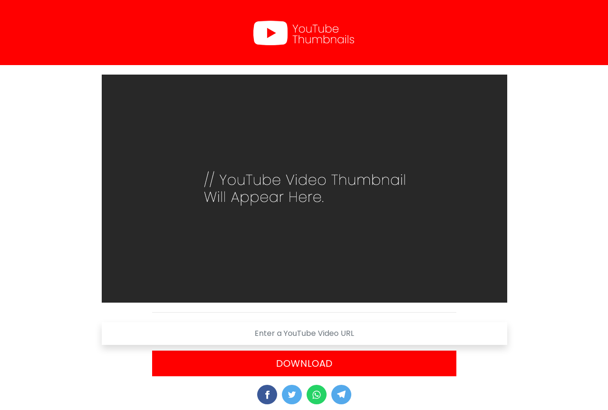

# YouTube Thumbnail Downloader

YouTube Thumbnail Downloader is a Tool. Which can be created using HTML, CSS and Javascript. With the help of this tool you can download the “Thumbnail” used on any YouTube video. That too with their requirement and different quality.

But you must know the URL of that video. After that, you can download the thumbnail of that video in 240/360/720 resolution. Now as soon as you enter the “URL” of your video in this input box, then after that you have to click on the button “Download”. After which some such options i.e. buttons will come in front of you.

You can download the Thumbnails in Three Different Qualities, they are:
* High Quality (Maximum Resolution - Full HD)
* Medium Quality (Medium Resolution - HD)
* Low Quality (Lowest Resolution - SD)

## Features
* Easy to Download (No SignUp Required)
* Loads Fast
* Clean UI and UX
* Responsive
* Mobile-Friendly

## License
Distributed under the MIT License. See `LICENSE` for more information.
